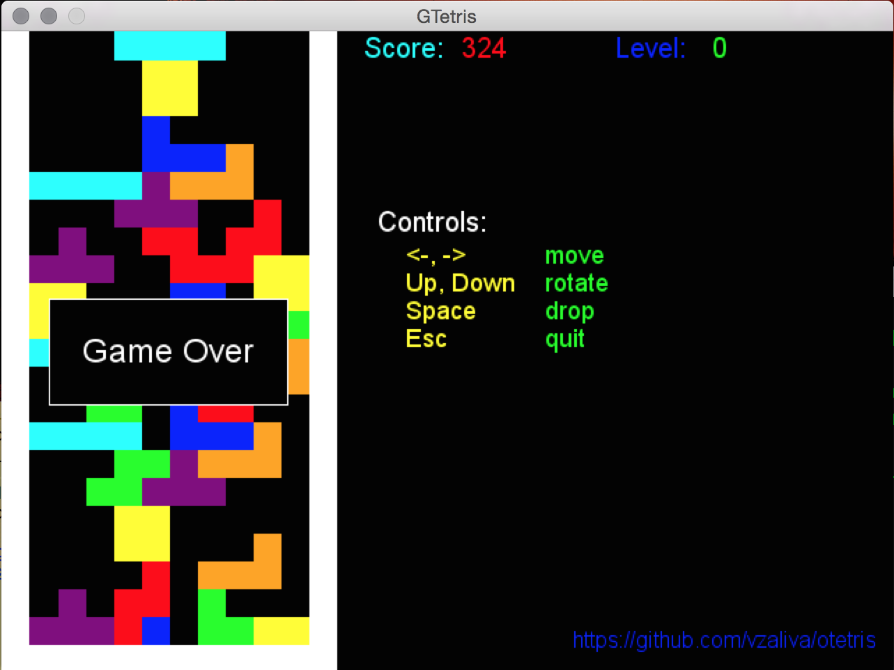
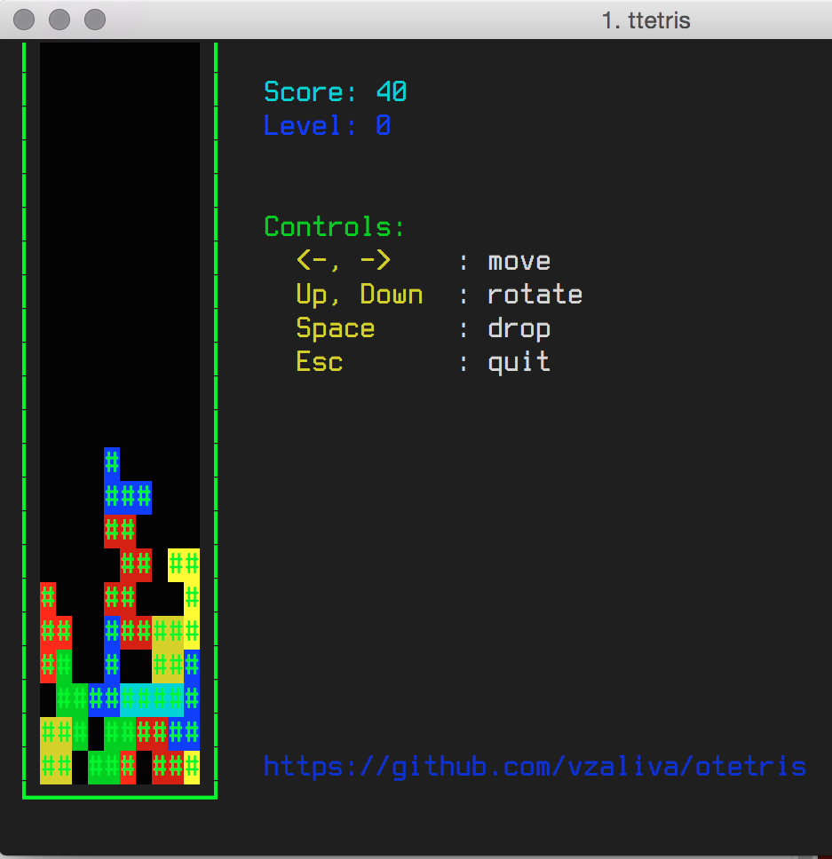

# OCaml Tetris

Simple Tetris game written in OCaml language.

Graphics mode:

        

Text mode:

        

Tetris game model is followig Tetris Guidelines from http://tetris.wikia.com/

1. "Super Rotation System": http://tetris.wikia.com/wiki/SRS
2. "Tetris Random Generator": http://tetris.wikia.com/wiki/Random_Generator
3. "Original Nintendo Scoring System": http://tetris.wikia.com/wiki/Scoring 

It is written in pure-functional style, whenever possible and not
designed for efficiency but rather as OCaml learning excericse.

### Dependencies
1. https://github.com/diml/lambda-term
2. http://batteries.forge.ocamlcore.org/
3. http://ocamlsdl.sourceforge.net/home.html

To install dependencies on Mac (using ``macports`` and ``opam``):

    $ sudo port install libsdl2 libsdl2_image libsdl2_mixer libsdl2_net libsdl2_ttf
    $ opam install conf-sdl2-image conf-sdl2-mixer conf-sdl2-net conf-sdl2-ttf ocamlsdl

### MIsc
If you feel nostalgic, you should try to play using this terminal emulator:

https://github.com/Swordfish90/cool-retro-term

For example chose IBM 3278 mode and make sure your font is scaled down
to 50% so it would allow 80 columns and 25 rows.

### TODO

The following features are not implmented yet:

1. Wall kicks
2. Soft Drop
3. Leveling up and speed increase
4. T-Spin bonus
5. Lock delay (but perhaps we have an implicit one due to fixed timer)
6. Optional display of next-coming tetrominoes
7. Optional ghost (shadow) piece display

### Author
Vadim Zaliva lord@crocodile.org

### License

The MIT License (MIT)

Copyright (c) 2015 Vadim Zaliva

Permission is hereby granted, free of charge, to any person obtaining a copy
of this software and associated documentation files (the "Software"), to deal
in the Software without restriction, including without limitation the rights
to use, copy, modify, merge, publish, distribute, sublicense, and/or sell
copies of the Software, and to permit persons to whom the Software is
furnished to do so, subject to the following conditions:

The above copyright notice and this permission notice shall be included in
all copies or substantial portions of the Software.

THE SOFTWARE IS PROVIDED "AS IS", WITHOUT WARRANTY OF ANY KIND, EXPRESS OR
IMPLIED, INCLUDING BUT NOT LIMITED TO THE WARRANTIES OF MERCHANTABILITY,
FITNESS FOR A PARTICULAR PURPOSE AND NONINFRINGEMENT. IN NO EVENT SHALL THE
AUTHORS OR COPYRIGHT HOLDERS BE LIABLE FOR ANY CLAIM, DAMAGES OR OTHER
LIABILITY, WHETHER IN AN ACTION OF CONTRACT, TORT OR OTHERWISE, ARISING FROM,
OUT OF OR IN CONNECTION WITH THE SOFTWARE OR THE USE OR OTHER DEALINGS IN
THE SOFTWARE.

